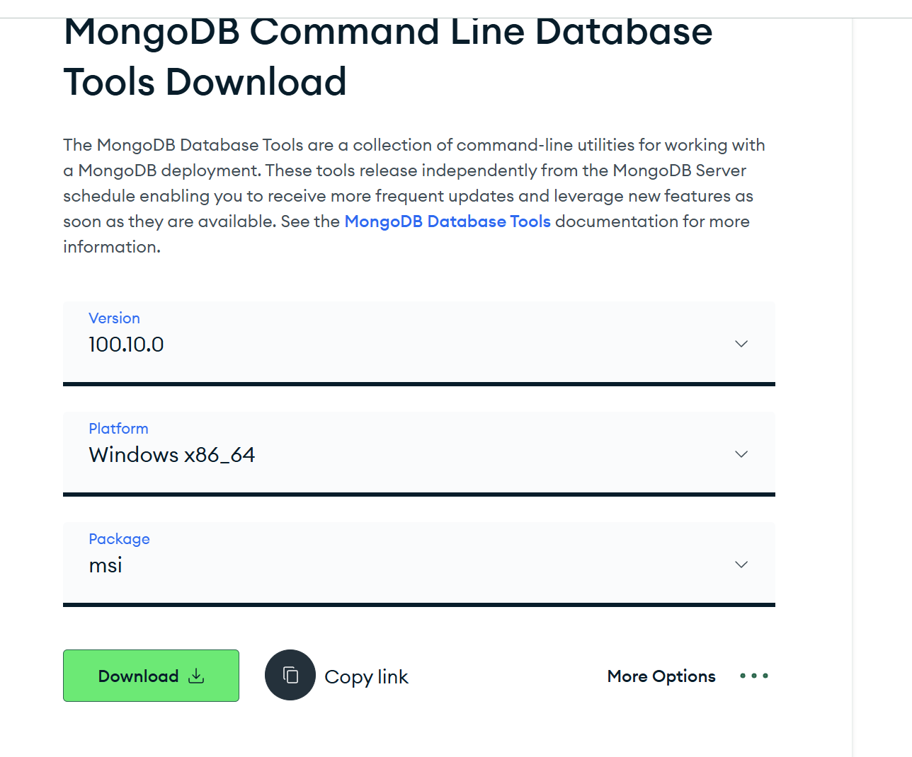
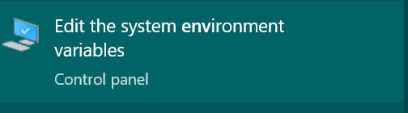
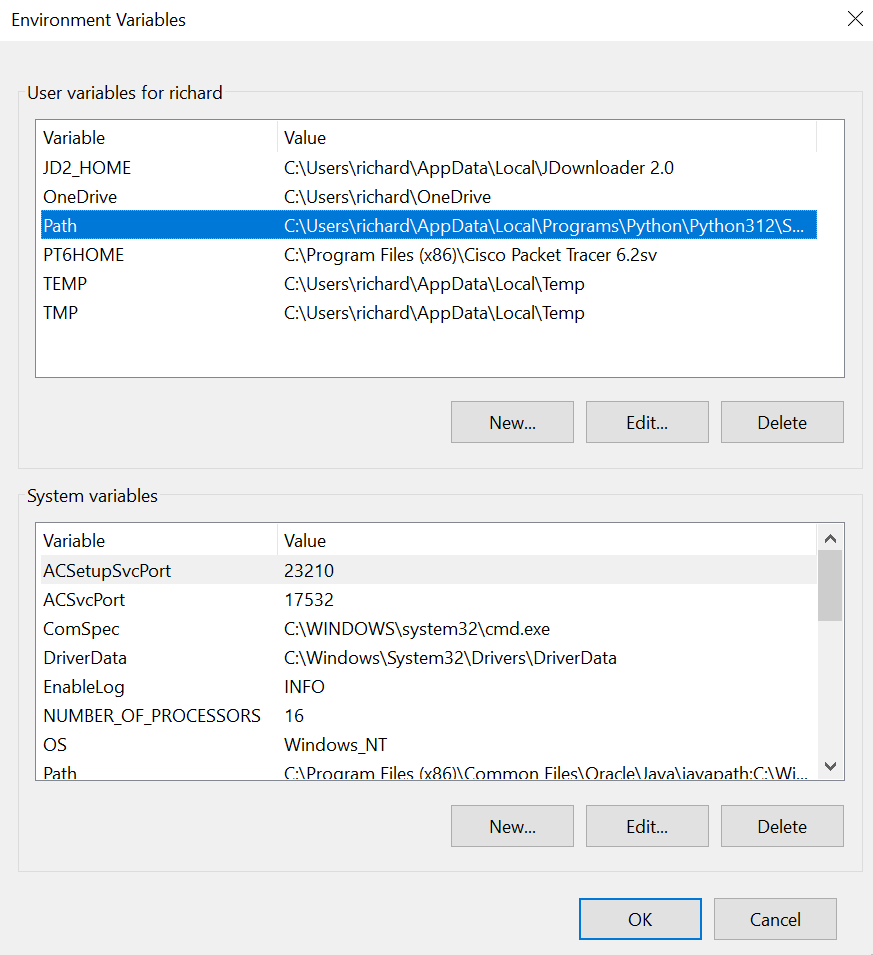

ini buat yang mau masukin db nya tanpa lewat import satu per satu 
lewat mongodbcompass

cara import:

1. buka cmd atau powershell atau vscode, yang ada terminalnya lah

2. cd C:\Program Files\MongoDB\Server\7.0\bin
7.0 nya itu versinya , sesuaikan sama versi sekarang
kalau gk ketemu langsung masukin cd C:\Program Files\MongoDB\Server
nanti ngecek versinya 

3. masukin projectFPW.gz di dalam cd C:\Program Files\MongoDB\Server\7.0\bin

4. untuk importnya nanti tinggal kasih command : 
mongorestore --gzip --archive=projectFPW.gz --db projectFPW

optional
5. mongodump --archive=projectFPW.gz --gzip --db projectFPW ini untuk ngedump nya (export nya )
nanti sudah ada filenya di bin 

note:
harus install mongoDB database tools
kalau sudah di skip

cara installnya

1. pergi ke https://www.mongodb.com/try/download/database-tools

 lalu click download package nya dianjurkan bentuk msi

2. lalu cari environment variables 

3. buka environment variables

4. ketuk path habis itu pencet edit 

5. ini kalau sudah masukin pathnya, kalau belum ketuk new baru ketik 
  
 cd C:\Program Files\MongoDB\Server\<version>\bin
 <version> sesuai sama versi mongodb nya 
 

6. kalau sudah untuk check nya ulangi step 1 - 2 cara importnya  
lalu ketik mongodump --version

7. kalau muncul versinya berhasil download nya 
